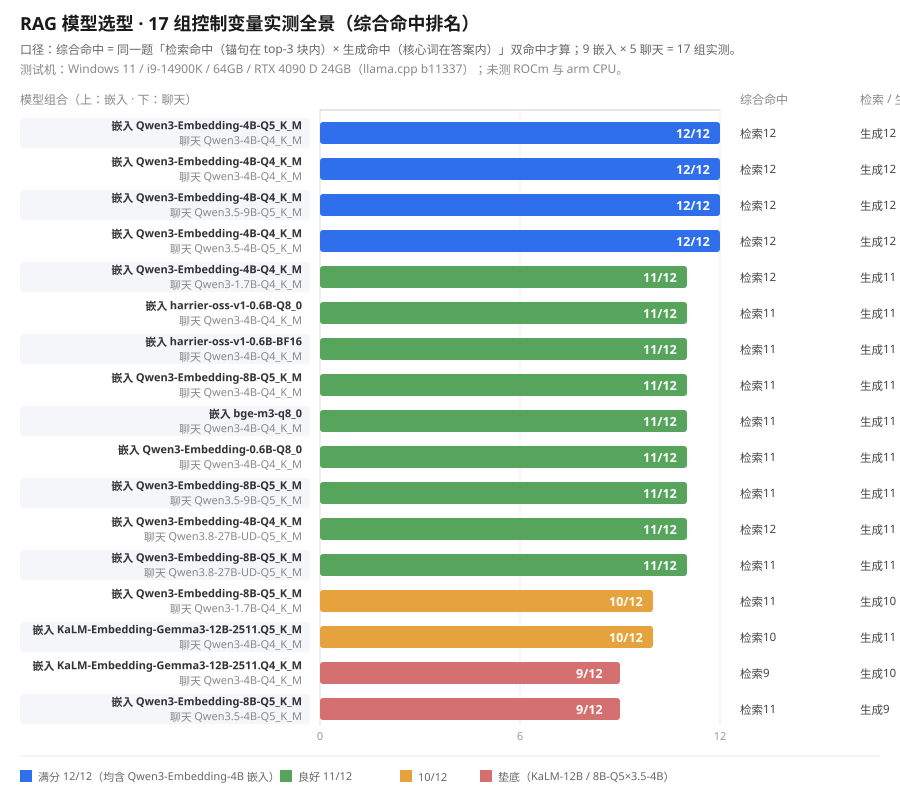

# RAG 手写全链路

> 从零手写 RAG（检索增强生成）全链路 + FastAPI 整合包：本地私有知识库问答，**答案可追溯**。

项目用最朴素的 Python 实现 RAG 的每一环——切块、向量化、存储、余弦检索、Prompt 拼装、生成——不用任何 RAG 框架封装，代码量小、可读性强，既是求职作品，也是学习路线图。

## 亮点

- **手写核心链路**：切块（窗口切 + 标题结构切）、向量化（本地 embedding 模型）、SQLite 存储（BLOB + 去重幂等）、手写余弦相似度 top-k、RAG prompt 拼装——每块代码都能逐行解释
- **答案可追溯**：回答附参考源，演示页右侧侧边栏点击展开原文块，模型依据一验即知
- **开箱即用**：启动本地模型服务后，打开演示页即可上传文档、提问、查看来源、删改知识库
- **全本地运行**：模型用 GGUF 跑在 llama.cpp，数据不出机器
- **工程规范**：uv 环境 + ruff 格式 + mypy 静态检查 + pytest 63 个测试全绿；git 提交遵循 Conventional Commits

## 实测数据（9 嵌入 × 5 聊天，17 组控制变量）

全部结论基于本机实测（Windows 11 / i9-14900K / 64GB / RTX 4090 D 24GB，llama.cpp b11337；未测 ROCm 与 arm CPU），完整表格见 [docs/模型选型报告.md](docs/模型选型报告.md)。

**17 组实测全景（综合命中排名，每行上为嵌入模型、下为聊天模型）：**



一句话结论：**嵌入选 Qwen3-Embedding-4B-Q4_K_M（唯一综合 12/12 档）**，聊天按硬件选 **Qwen3-4B-Q4_K_M（CPU，1.6s/题）或 Qwen3.5-9B-Q5_K_M（独显，3.4s/题）**；Qwen3.8-27B 与 KaLM-Embedding-Gemma3-12B 无质量优势且慢/大，已淘汰。

## 架构

```
              ┌────────────────────────────────────────────────────┐
              │                    RAG 管线（手写）                  │
  上传文档     │                                                    │
 ─────────►  │  归一化 ─► 切块 ─► 向量化 ─► SQLite 存储             │
  提问        │                    │                                │
 ─────────►  │              余弦检索 top-k ◄─────── 向量化提问      │
              │                    │                                │
              │           拼 Prompt（资料+问题+不编造指令）          │
              │                    │                                │
              │            本地模型生成 ─► 回答 + 参考源            │
              └────────────────────────────────────────────────────┘
    输入                  FastAPI（/ask /library /history /static）
```

## 快速开始

两条路，按需选择：

### 路径 A：纯测试模式（不需要模型、不需要显卡）

```powershell
uv sync
uv run pytest -q        # 63 passed
uv run ruff check rag tests main.py scripts
uv run mypy
```

测试全部用 mock，不依赖真实模型，适合快速了解代码与跑通 CI 姿势。

### 路径 B：完整体验（本地模型 + 演示页）

前置：Windows + uv + llama.cpp（CUDA 版），模型文件放在本地模型目录（下面命令中的 `D:\你的模型目录` 按实际路径改）。

1. **启动嵌入模型**（8081 端口，`--embedding --pooling last` 是编码模型必带参数）：

```powershell
llama-server.exe -m D:\你的模型目录\qwen3-embed\Qwen3-Embedding-8B-Q5_K_M.gguf --embedding --pooling last -c 8192 -b 8192 -ub 8192 --host 127.0.0.1 --port 8081
```

2. **启动对话模型**（8080 端口，普通聊天模型，不带 `--embedding`）：

```powershell
llama-server.exe -m D:\你的模型目录\qwen3.5\Qwen3.5-4B-Q5_K_M.gguf -c 8192 -b 8192 -ub 8192 --host 127.0.0.1 --port 8080
```

3. **构建知识库**（可选，内置示例文档 `docs/RAG学习笔记01-模型服务与向量化输入.md`）：

```powershell
uv run python -m scripts.build_kb "docs\RAG学习笔记01-模型服务与向量化输入.md" --reset
```

4. **启动服务**：

```powershell
uv run uvicorn main:app --host 127.0.0.1 --port 8000
```

5. 浏览器打开 <http://127.0.0.1:8000> 开始体验：提问、点击参考源展开原文、上传自己的 txt/md 追加入库。

详细步骤与常见问题见 [docs/快速上手.md](docs/快速上手.md)。想零代码开箱即用？下载整合包（CPU / CUDA / Online 三版），见下方 [整合包下载与使用教程](#整合包下载与使用教程)。

## 整合包下载与使用教程

不想折腾环境？下载整合包，解压双击 `start.bat` 即用（模型内置 / 在线版自动下载）：

- **百度网盘**（永久有效，无需提取码）：https://pan.baidu.com/s/59PrnR8lAbw0h0AbsHok08w
- **视频教程（B 站）**：[RAG_HandProj 整合包使用教程](https://www.bilibili.com/video/BV1kXHf6tE3i/)

| 版本 | 大小 | 说明 | 适用 |
| --- | --- | --- | --- |
| RAG_HandProj_CPU_v0.1.0.zip | 4.59 GB | 模型直打，纯 CPU 运行 | 无独立显卡 / 老电脑 |
| RAG_HandProj_CUDA_v0.1.0.zip | 9.53 GB | 模型直打，CUDA 12/13 双后端自动选 | NVIDIA 独显 |
| RAG_HandProj_Online_v0.1.0.zip | 1.23 GB | 缺模型自动下载（断点续传），启动可选 CPU / 核显 / 独显档位 | 网速好、想省流量 |

下载后运行网盘内的 **`校验压缩包完整性.bat`**（依赖同目录 `SHA256SUMS.txt`）校验三个压缩包是否完整、未被篡改。

## 项目结构

```
RAG_HandProj/
├── main.py              # FastAPI 入口：/ask 问答、/library 知识库管理、/history、演示页
├── rag/
│   ├── normalize.py     # Markdown 方言归一化（callout / 脚注降级）
│   ├── chunking.py      # 切块器：标题结构切 + 超长节窗口切 + 无标题兜底
│   ├── embed.py         # 向量化客户端（POST /v1/embeddings）
│   ├── store.py         # SQLite 存储：chunks（去重幂等）+ history + 余弦检索
│   └── generate.py      # 生成客户端：RAG prompt 拼装 + 调对话模型
├── scripts/build_kb.py  # 构建知识库 CLI
├── static/index.html    # 离线演示页（答案 + 可点击参考源侧边栏）
├── tests/               # 63 个测试（mock 链路 + 契约）
├── docs/                # 源码导读、使用说明、选型报告、学习笔记
└── CONTRIBUTING.md      # 提交规范（Conventional Commits + 分支语义）
```

## API 一览

| 接口 | 说明 |
|---|---|
| `GET /` | 演示页（离线单页） |
| `POST /ask` | 问答：`{"query": "..."}` → `{"answer": "...", "sources": [{source, content}]}` |
| `GET /library` | 知识库清单（文档 + 块数） |
| `POST /library` | 上传 txt/md 追加入库（自动归一化 → 切块 → 向量化） |
| `DELETE /library/{source}` | 删除文档 |
| `GET /history` | 问答历史（最新在前） |
| `GET /docs` | Swagger UI（接口文档） |

## 分支语义（git log 就是课程地图）

- `main`：里程碑主线，每次合并 = 一个可验收的知识点
- `dev`：碎步工作区，过程细节在这里

```
main  M1 工具链 ─► M2 核心链路 ─► M3 /ask 全链路 ─► M4 知识库管理 ─► M5 门面文档
```

## 技术栈与工具

FastAPI / SQLite / requests / uv / ruff / mypy / pytest / llama.cpp（本地推理）

## License

**AGPLv3** —— 允许商用，但你必须告知使用者源码可免费获取；修改或再分发（含部署为网络服务）后，修改版同样必须以 AGPLv3 开源。模型文件与文档内容版权归各自来源。

全文见 [LICENSE](LICENSE)。
